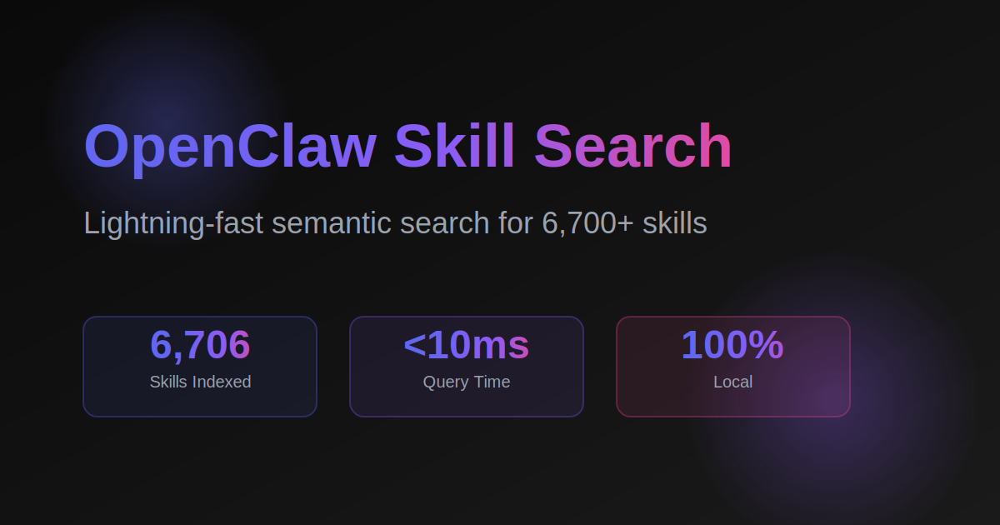

# OpenClaw Skill Search - Landing Page

A stunning, production-ready landing page for the OpenClaw Skill Search plugin. Built with Next.js 15, TypeScript, and Tailwind CSS.



## 🎨 Design Features

- **Premium Dark Mode**: Modern glassmorphism with gradient accents
- **Smooth Animations**: Floating orbs, slide-ups, hover effects, and micro-animations
- **Interactive Demo**: Live search interface with mock results
- **Fully Responsive**: Optimized for mobile, tablet, and desktop
- **SEO Optimized**: Proper meta tags, semantic HTML, and fast performance
- **Performance**: Built for speed with optimized fonts and assets

## 🚀 Quick Start

### Prerequisites

- Node.js 18+ 
- npm or yarn

### Local Development

```bash
# Install dependencies
npm install

# Run development server
npm run dev

# Open http://localhost:3000
```

### Build for Production

```bash
# Create production build
npm run build

# Test production build locally
npm start
```

## 📦 Project Structure

```
skillsearch-landing/
├── app/
│   ├── layout.tsx          # Root layout with SEO metadata
│   ├── page.tsx             # Main landing page
│   └── globals.css          # Global styles and animations
├── components/
│   ├── Hero.tsx             # Hero section with CTA
│   ├── ProblemSolution.tsx  # Problem/Solution comparison
│   ├── LiveDemo.tsx         # Interactive search demo
│   ├── Features.tsx         # Feature showcase
│   ├── HowItWorks.tsx       # Architecture diagram
│   ├── Installation.tsx     # Installation guide
│   ├── Roadmap.tsx          # Product roadmap timeline
│   ├── CTA.tsx              # Final call-to-action
│   └── Footer.tsx           # Footer with links
├── public/
│   └── og-image.svg         # OpenGraph social share image
├── vercel.json              # Vercel deployment config
├── package.json             # Dependencies
└── README.md                # This file
```

## 🌐 Deployment to Vercel

### Option 1: Vercel CLI (Recommended)

1. **Install Vercel CLI**
   ```bash
   npm install -g vercel
   ```

2. **Login to Vercel**
   ```bash
   vercel login
   ```

3. **Deploy**
   ```bash
   cd /home/khanh/.openclaw/workspace/skillsearch-landing
   vercel
   ```

4. **Follow the prompts:**
   - Set up and deploy: `Y`
   - Scope: Select your account/team
   - Link to existing project: `N`
   - Project name: `skillsearch-landing`
   - Directory: `.` (press Enter)
   - Override settings: `N`

5. **Deploy to production**
   ```bash
   vercel --prod
   ```

### Option 2: Vercel Dashboard

1. **Push to GitHub**
   ```bash
   cd /home/khanh/.openclaw/workspace/skillsearch-landing
   git init
   git add .
   git commit -m "Initial commit: OpenClaw Skill Search landing page"
   git remote add origin https://github.com/YOUR_USERNAME/skillsearch-landing.git
   git push -u origin main
   ```

2. **Import to Vercel**
   - Go to [vercel.com/new](https://vercel.com/new)
   - Import your GitHub repository
   - Framework Preset: Next.js (auto-detected)
   - Click "Deploy"

### Custom Domain Setup

1. **Add Custom Domain in Vercel**
   - Go to your project settings in Vercel
   - Navigate to "Domains"
   - Add `skillsearch.thevibecoding.dev`

2. **Configure DNS (at your domain provider)**
   
   Add a CNAME record:
   ```
   Type:  CNAME
   Name:  skillsearch
   Value: cname.vercel-dns.com
   TTL:   Auto
   ```

3. **Verify Domain**
   - Vercel will automatically verify the domain
   - SSL certificate will be provisioned automatically (Let's Encrypt)

4. **Wait for DNS Propagation**
   - Usually takes 5-30 minutes
   - Check status at `https://dnschecker.org`

## 🔧 Environment Variables

This project doesn't require any environment variables for basic deployment. However, you can add optional variables:

```bash
# .env.local (optional)

# Analytics (optional)
NEXT_PUBLIC_GA_ID=G-XXXXXXXXXX

# API endpoint for real search (future)
NEXT_PUBLIC_API_URL=https://api.skillsearch.dev
```

## 📊 Performance Optimizations

- **Fonts**: Using Google Fonts (Inter, JetBrains Mono) with `font-display: swap`
- **Images**: SVG for scalable graphics, optimized for fast loading
- **CSS**: Tailwind CSS v4 with PostCSS for minimal bundle size
- **JavaScript**: Client components only where needed, server-side rendering for static content
- **Caching**: Vercel edge network for global CDN delivery

## 🎯 Sections Overview

### 1. Hero Section
- Eye-catching headline with gradient text
- Value proposition
- CTA buttons (Try Demo, Get Started)
- Live stats (6,706 skills, <10ms, 100% local)
- Animated background with floating orbs

### 2. Problem/Solution
- Side-by-side comparison
- Visual indicators (✗ for problems, ✓ for solutions)
- Clear value proposition

### 3. Live Demo
- Interactive search box
- Natural language input
- Real-time mock results
- Performance metrics display
- Example queries for easy testing

### 4. Features
- 6 key features in grid layout
- Gradient icons with hover effects
- Bottom stats bar

### 5. How It Works
- 6-step architecture visualization
- Technology stack showcase
- Visual process flow

### 6. Installation
- 3-step installation guide
- Copy-to-clipboard code snippets
- Requirements checklist

### 7. Roadmap
- 4-phase timeline (Q4 2025 - Q3 2026)
- Progress bars for each phase
- Visual status indicators

### 8. CTA
- Final conversion section
- Multiple CTA buttons
- Quick stats recap
- Resource links (Docs, Registry, Community)

### 9. Footer
- Brand information
- Social links (GitHub, Twitter, Discord)
- Sitemap navigation
- Copyright and license info

## 🎨 Design System

### Colors
```css
Primary Gradient:   #6366f1 → #8b5cf6 → #ec4899
Background:         #0a0a0a
Foreground:         #ededed
Glass Background:   rgba(15, 15, 15, 0.6) + backdrop-blur
```

### Typography
- **Headings**: Inter (via Google Fonts)
- **Code**: JetBrains Mono (via Google Fonts)
- **Sizes**: Fluid scaling from mobile to desktop

### Components
- **Glass Cards**: Glassmorphism with blur and subtle borders
- **Gradient Buttons**: Hover glow effects
- **Animations**: Float, pulse-glow, slide-up

## 🧪 Testing Checklist

- [x] Development server runs (`npm run dev`)
- [x] Production build succeeds (`npm run build`)
- [x] All sections render correctly
- [x] Mobile responsive (375px - 1920px)
- [x] Interactive demo works
- [x] Copy-to-clipboard functions
- [x] Smooth scroll anchors work
- [x] All animations run smoothly
- [x] SEO meta tags present
- [x] OG image loads correctly

## 🐛 Troubleshooting

### Build Errors

**Issue**: `Module not found: Can't resolve '@/components/...'`
```bash
# Solution: Ensure tsconfig.json has correct path mapping
{
  "compilerOptions": {
    "paths": {
      "@/*": ["./*"]
    }
  }
}
```

**Issue**: Tailwind styles not applying
```bash
# Solution: Verify postcss.config.mjs exists
# Run: npm install @tailwindcss/postcss
```

### Deployment Issues

**Issue**: Custom domain not working
- Check DNS propagation: `nslookup skillsearch.thevibecoding.dev`
- Verify CNAME points to `cname.vercel-dns.com`
- Wait 30 minutes for DNS to propagate globally

**Issue**: 404 on deployed site
- Ensure `vercel.json` is in root directory
- Redeploy with `vercel --prod`

## 📝 Customization Guide

### Change Colors
Edit `app/globals.css`:
```css
:root {
  --accent: #YOUR_COLOR;
  --gradient-start: #YOUR_START;
  --gradient-end: #YOUR_END;
}
```

### Add New Sections
1. Create component in `components/YourSection.tsx`
2. Import in `app/page.tsx`
3. Add to the page layout

### Update Content
- Hero text: `components/Hero.tsx`
- Features: `components/Features.tsx`
- Roadmap phases: `components/Roadmap.tsx`

## 🔗 Links

- **Live Site**: https://skillsearch.thevibecoding.dev (after deployment)
- **GitHub**: https://github.com/openclaw/skill-search
- **Documentation**: See main repo
- **OpenClaw**: https://openclaw.dev

## 📄 License

MIT License - feel free to use this landing page as a template for your own projects!

## 🙏 Credits

- Built with [Next.js 15](https://nextjs.org/)
- Styled with [Tailwind CSS v4](https://tailwindcss.com/)
- Deployed on [Vercel](https://vercel.com/)
- Icons from [Heroicons](https://heroicons.com/)
- Fonts from [Google Fonts](https://fonts.google.com/)

---

**Built with ❤️ for the OpenClaw community**
